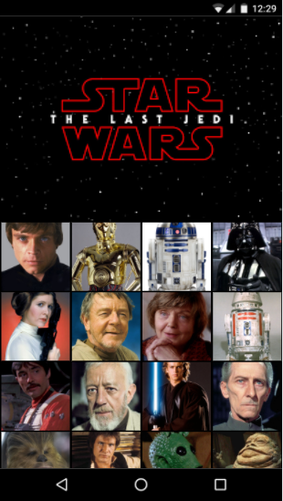

# SWAPI

## Descripción

El reto de este proyecto es poder aplicar nuestro conocimiento en HTML 5, JavaScript ES6, CSS y el uso de APIs, en esta ocasión usaremos el API de StarWars, donde utilizaremos la información de cada personaje para poder visualizarlo en un collage. 
 #### Las condiciones son las siguientes:

* Visualizarse en vista mobile.
* Usar **API STAR WARS** para los datos.
* El API no brinda imágenes, uso libre de las mismas. 
 

## Herramientas utilizadas 
 1.  **HTML 5** : Estructura de la página.
 2. **JavaScript ES6** : Lenguaje de programación.
 3. **API STAR WARS** : Uso de información. 
 4. **FECTH** : Herramienta para manupular la data. 

## Resultado

